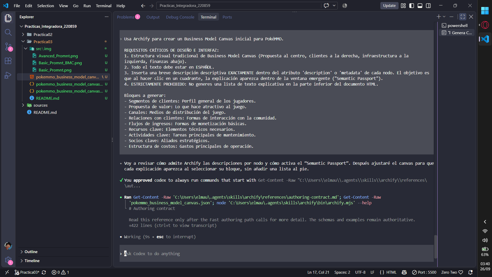
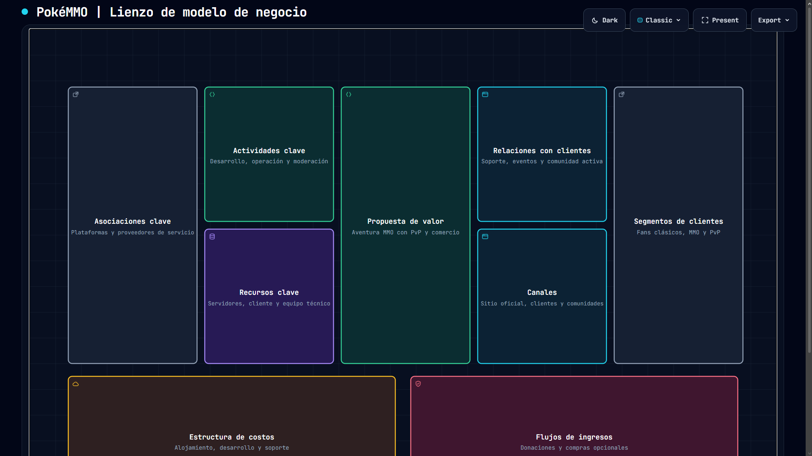
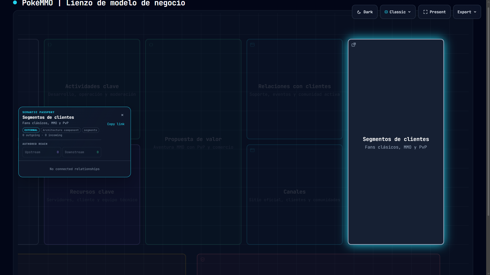
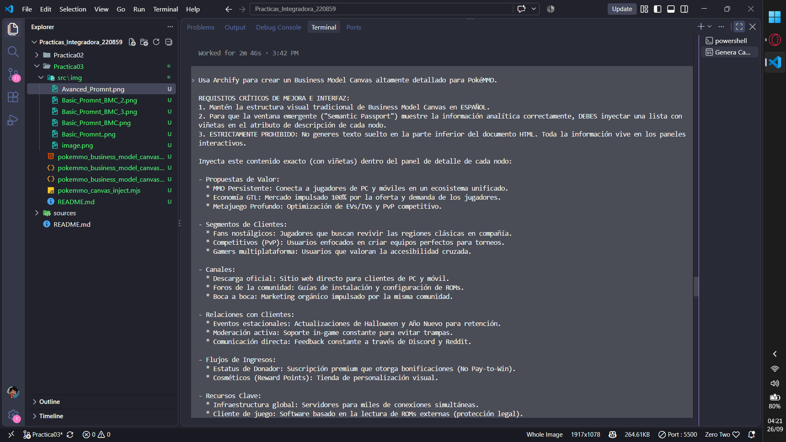
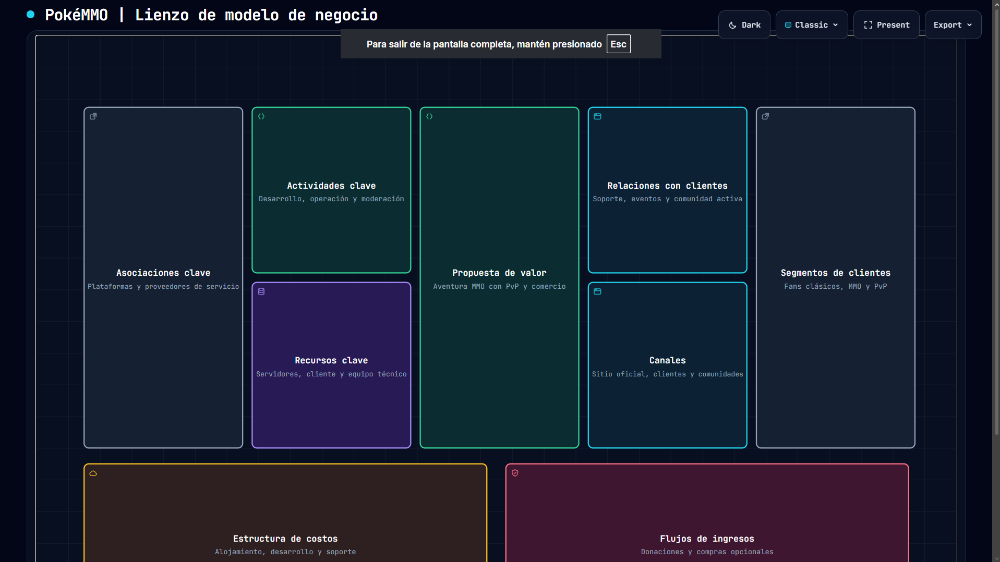
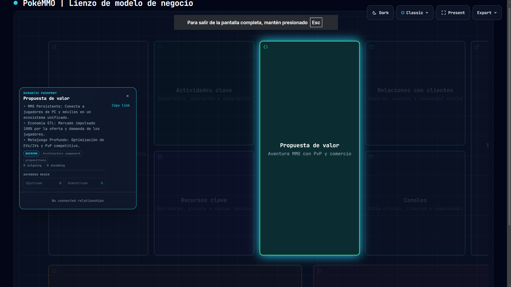

# 📊 Práctica 03: Business Model Canvas de PokéMMO con Archify

  
  
  
  
  

---

## 🚀 Despliegue del Modelo

👉 **[Ver Business Model Canvas Interactivo en GitHub Pages](https://elmau0834x.github.io/Practicas_Integradora_220859/Practica03/pokemmo_business_model_canvas.html)**

---

## 📋 Objetivo de la Práctica
Utilizar la herramienta de modelado arquitectónico **Archify** a través de **Codex CLI** para generar un modelo de negocio Canvas de una aplicación multiplataforma de uso cotidiano. Se aplicó ingeniería de prompts iterativa para refinar el resultado de un modelo genérico a uno altamente detallado.

## 🕹️ Aplicación Seleccionada: PokéMMO
Se eligió **PokéMMO**, un título multiplataforma (PC, Android, iOS, Mac, Linux) con un modelo de negocio destacable que evita mecánicas *Pay-to-Win* y sostiene una economía impulsada enteramente por los jugadores.

---

## 🛠️ Evolución e Ingeniería de Prompts

Para cumplir con los requisitos de la práctica, se realizó un proceso iterativo de mejora del prompt, solucionando problemas de visualización y profundidad analítica:

### Iteración 1: Generación Base (Modelo Inicial)
Se solicitó a la IA la creación del modelo estándar. Aunque Archify respetó la estructura visual del Canvas, el panel emergente interactivo ("Semantic Passport") carecía de profundidad, mostrando únicamente texto plano y repetitivo.

**Prompt utilizado (Fragmento):**
> "Usa Archify para crear un Business Model Canvas inicial para PokéMMO. REQUISITOS CRÍTICOS: Estructura visual tradicional... Inserta una breve descripción descriptiva EXACTAMENTE dentro del atributo 'description'."

*(Captura de la instrucción base en la terminal de Codex)*

*(Vista general del diagrama HTML generado)*

*(El panel emergente muestra un diseño básico sin viñetas ni profundidad analítica)*

### Iteración 2: Refinamiento del Modelo (Inyección de Datos)
Para solucionar la falta de profundidad, se aplicó ingeniería de prompts estructurando la información con **listas de viñetas (bullets)** directamente en el prompt. Se inyectó contexto específico sobre la economía in-game (Global Trade Link), el enfoque competitivo (EVs/IVs) y la monetización cosmética estricta.

**Prompt refinado (Fragmento):**
> "Usa Archify para crear un Business Model Canvas altamente detallado... DEBES inyectar una lista con viñetas en el atributo de descripción de cada nodo. ESTRICTAMENTE PROHIBIDO: No generes texto suelto en la parte inferior... Toda la información vive en los paneles interactivos."

*(Captura del prompt avanzado con inyección de listas estructuradas)*

*(Vista general del diagrama HTML refinado)*

*(El "Semantic Passport" ahora muestra un análisis profundo estructurado correctamente con viñetas)*

---
**Autor:** Mauricio Rosales Gabriel (Matrícula: `220859`)  
**Universidad:** Universidad Tecnológica de Xicotepec de Juárez (UTXJ).